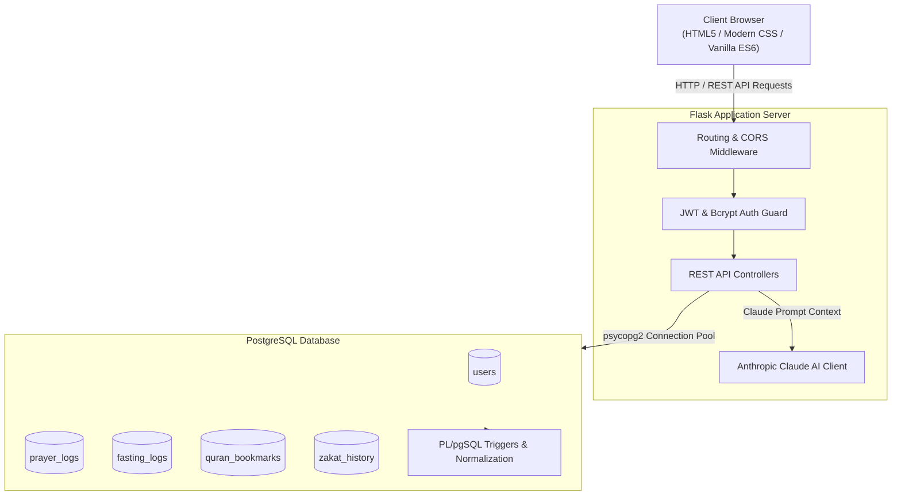

# 🌙 Al-Hidayah — Islamic Lifestyle & Spiritual Companion Web Platform

[](#)
[](#)
[](#)
[](#)
[](#)
[](LICENSE)

> A full-stack, PostgreSQL-powered spiritual companion platform providing Holy Quran recitation with multilingual translations, dynamic geolocation-based prayer times, an intelligent Ramadan tracker, Zakat calculation engine, and an AI-powered spiritual chatbot powered by Anthropic Claude.

---

## 🌟 Key Features

- 📖 **Holy Quran Companion:** Interactive chapter and verse explorer with Arabic typography, transliteration, and multilingual translations with smart verse bookmarking.
- ⏰ **Dynamic Prayer & Iftar Schedule:** Geolocation-driven calculation engine supporting multiple calculation conventions (Karachi University, ISNA, Muslim World League).
- 📊 **Ramadan & Prayer Progress Tracker:** Interactive logging of daily prayers (`Fajr`, `Dhuhr`, `Asr`, `Maghrib`, `Isha`) and fasting milestones with analytics.
- 💰 **Automated Zakat Calculator:** Real-time wealth assessment against current Nisab thresholds (Gold/Silver) with persistent audit history.
- 🤖 **Spiritual AI Advisor:** Context-aware assistant integrated with Anthropic Claude API for answering Islamic inquiries, Ramadan guidance, and Quranic reflections.
- 🔐 **Secure Identity Architecture:** Salted password hashing via `bcrypt` and stateless session verification using signed `JSON Web Tokens (JWT)`.

---

## 🏗️ System Architecture



---

## 🗄️ Relational Database Architecture

The data tier is engineered in **PostgreSQL**, implementing 3NF relational normalization, foreign key constraints with cascading deletes, composite indexing for fast timestamp queries, and database triggers for automated record updating.

### Schema Highlights:
- **`users`**: Encrypted credentials (`password_hash`), geolocation coordinates (`latitude`, `longitude`), prayer calculation preferences (`calc_method`), and localized UI preferences.
- **`prayer_logs`**: Composite uniqueness on `(user_id, prayer_name, log_date)` ensuring idempotent tracking of daily obligations.
- **`fasting_logs`**: Tracks daily fasting status, missed fasts, and fidya/kaffara ledger.
- **`quran_progress`**: Granular tracking down to Surah, Ayah number, and reading duration.
- **`zakat_records`**: Snapshot of cash, gold, silver, and business inventory evaluated at point-in-time calculation.

---

## 📡 REST API Reference

### Authentication & Profiles
| Method | Endpoint | Description | Auth Required |
| :--- | :--- | :--- | :---: |
| `POST` | `/api/auth/register` | Create a new user account with encrypted password | No |
| `POST` | `/api/auth/login` | Authenticate credentials and receive Bearer JWT | No |
| `GET` | `/api/auth/me` | Fetch authenticated user profile & preferences | **Yes** |
| `PUT` | `/api/user/settings` | Update calculation methods, coordinates, and theme | **Yes** |

### Prayer & Fasting Telemetry
| Method | Endpoint | Description | Auth Required |
| :--- | :--- | :--- | :---: |
| `GET` | `/api/prayer/times` | Compute prayer and Sehri/Iftar timings for location | No |
| `POST` | `/api/prayer/log` | Record completed prayer status | **Yes** |
| `GET` | `/api/prayer/stats` | Fetch aggregated weekly/monthly prayer compliance | **Yes** |
| `POST` | `/api/fasting/log` | Record daily fast completion and notes | **Yes** |

### Quran, Zakat & AI Assistant
| Method | Endpoint | Description | Auth Required |
| :--- | :--- | :--- | :---: |
| `GET` | `/api/quran/surah/<id>` | Fetch Surah verses, transliterations, and audio links | No |
| `POST` | `/api/quran/progress` | Update user reading checkpoint | **Yes** |
| `POST` | `/api/zakat/save` | Persist calculated Zakat breakdown | **Yes** |
| `POST` | `/api/chatbot/message` | Submit query to Anthropic Claude AI spiritual guide | **Yes** |

---

## 🚀 Quickstart & Local Setup

### Prerequisites
- Python 3.10+
- PostgreSQL 14+
- Anthropic API Key (optional, for AI chatbot features)

### 1. Clone the Repository
```bash
git clone https://github.com/arslantariq364/Al-Hidayah-Islamic-Lifestyle-Quran-Companion-Web-Platform.git
cd Al-Hidayah-Islamic-Lifestyle-Quran-Companion-Web-Platform
```

### 2. Database Initialization
Create the database and apply the schema:
```bash
psql -U postgres -c "CREATE DATABASE alhidayah_db;"
psql -U postgres -d alhidayah_db -f schema.sql
```

### 3. Environment Configuration
Create a `.env` file in the root directory:
```env
DB_NAME=alhidayah_db
DB_USER=postgres
DB_PASS=your_postgres_password
DB_HOST=localhost
DB_PORT=5432
JWT_SECRET=your_super_secret_jwt_key
ANTHROPIC_API_KEY=your_anthropic_api_key_optional
```

### 4. Install Dependencies & Run
```bash
python3 -m venv venv
source venv/bin/activate  # On Windows: venv\Scripts\activate
pip install -r requirements.txt

python app.py
```
The server will boot at `http://127.0.0.1:5000`.

---

## 👨‍💻 Engineering Team

- **Arslan Tariq** (FAST NUCES — Roll No: 24P-0610)
- **Arif Ali** (FAST NUCES — Roll No: 24P-0736)

---

## 📜 License

Distributed under the MIT License. See [LICENSE](LICENSE) for more details.
